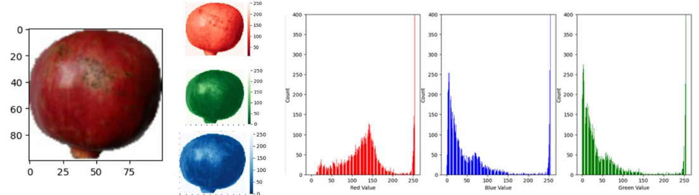
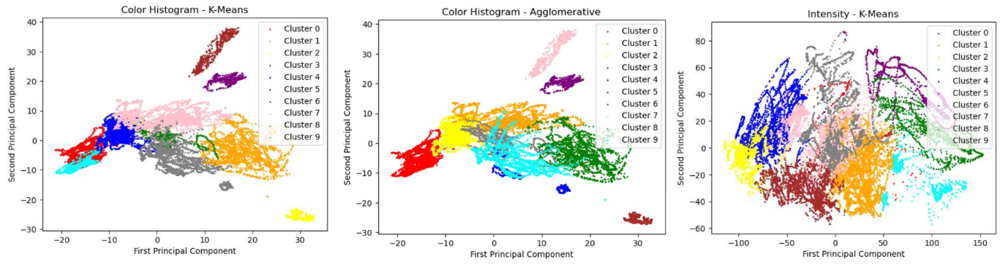
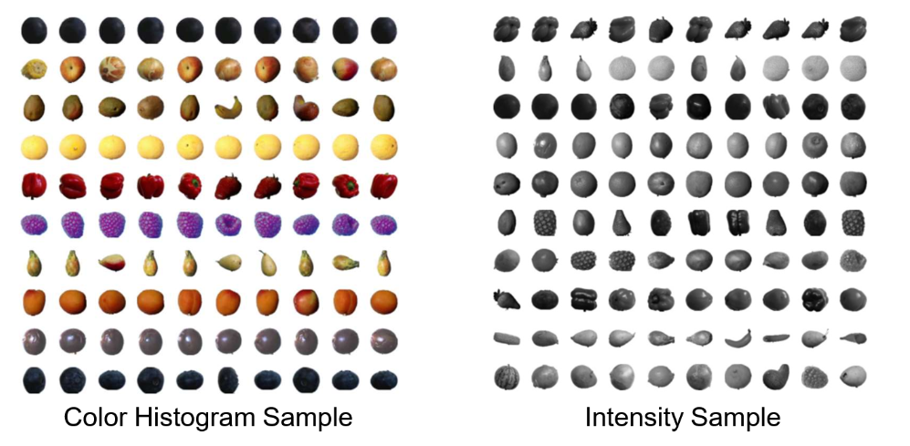

# Fruit-Image-Exploration-Clustering
This project was the final for CU Boulder's DTSA 5510 Unsupervised Algorithm in Machine Learning course. The project classified fruit images from a Kaggle [Fruit Classification Set](https://www.kaggle.com/datasets/sshikamaru/fruit-recognition/data) using unsupervised clustering methods. The project explored manual feature reduction to consider color and intensity by isolating greyscale value/intensity information and color histograms. 

After manual feature reduction, the datasets were scaled and further reduced using PCA to explain 90% of data variance. PCA also allowed the project to visualize possible clusters using the first two PCA components. K-means clustering analysis compared results of the two reduction methods, then compared to an agglomerative clustering method. Further hyperparameter tuning was performed to identify the k-means elbow number of clusters around 15 clusters

The below image visualizes the clustering methods and feature reduction methods for an arbitrary 10 clusters.

Likewise, the project can randomly sample points from the cluster to help intuit what the clustering algorithms are doing. Note below the color histogram features grouping by color, while the intensity features group by shape.

While this analysis does not quantitatively evaluate the performance of unsupervised clustering methods (such as via silhouette score), it does provide an understanding into the value and sacrifices of feature reduction and the various clustering method approaches.
